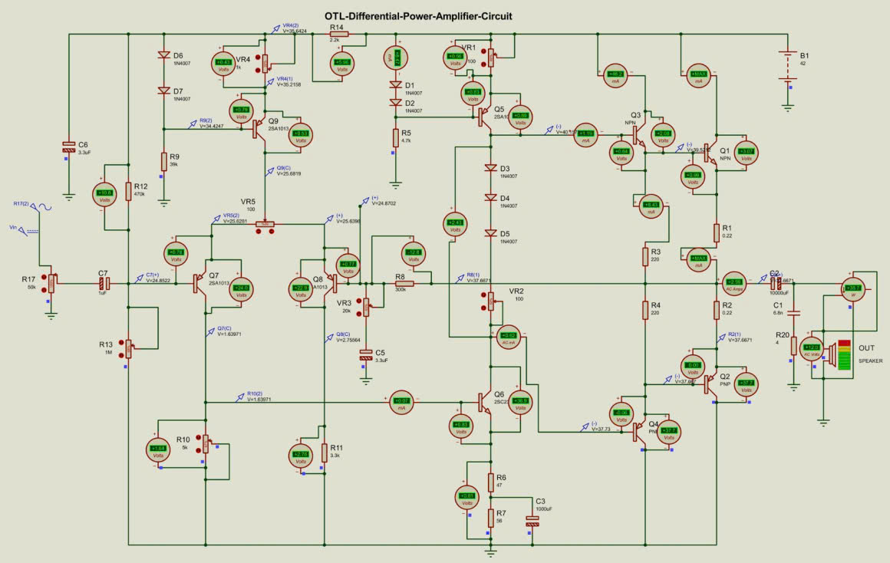
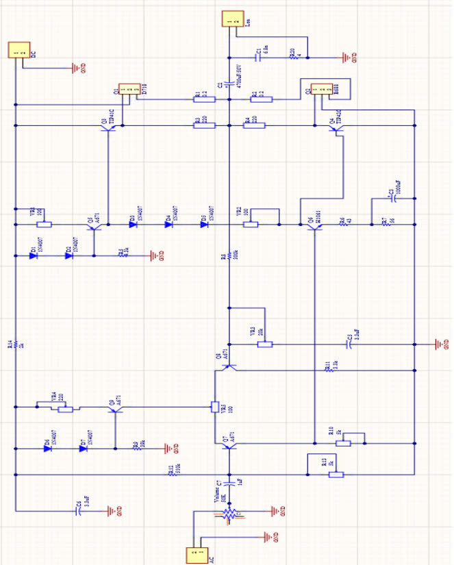
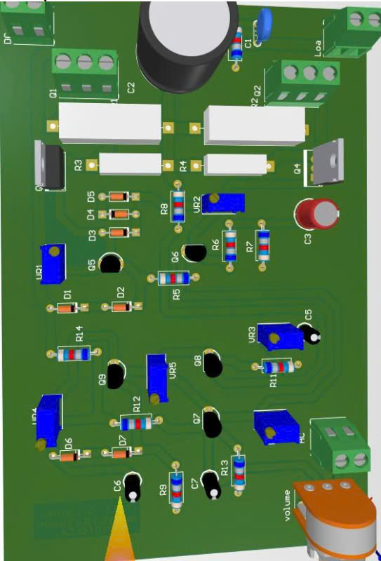
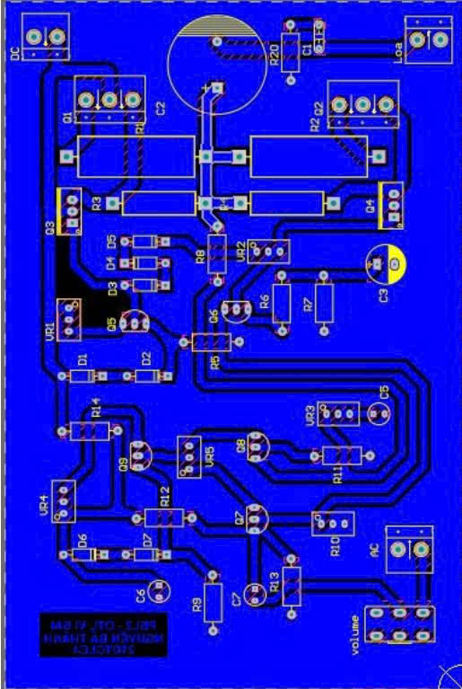
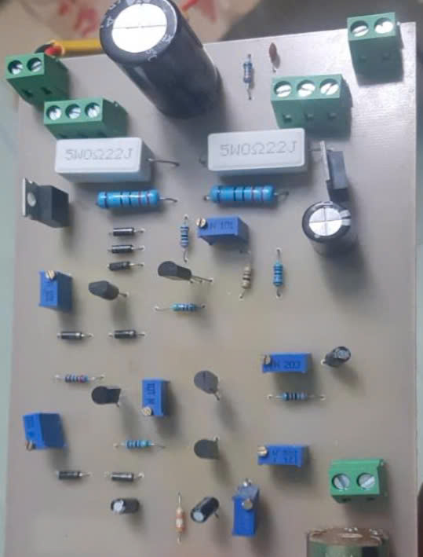

# PBL3

## Introduction
- Our products provide a solid and comprehensive foundation of expertise in the electronics field.
- We are proud to fully meet the design requirements for differential OTL power amplifier circuits.
- The product is composed of three main layers: differential layer, boost layer, and power layer.
- Each layer is calculated in detail, undertaking separate functions, contributing to creating a complete and effective product.
## How the System Works
### System Overview:
- Differential OTL (Output Transformer-Less) power amplifier is a type of amplifier designed to amplify electrical signals without using an output transformer. 
- This helps reduce the size, weight and cost of the system.

**Differential Stage:**
- The main task is to amplify the input signal, providing separation and adjustment between signals.
- This stage uses transistors or op-amps to create a differential signal, which helps increase sensitivity and reduce noise.
  
**Boost Stage:**
- This stage has the function of boosting the signal from the differential stage to the power stage.
- It ensures that the amplified signal is strong enough to be transmitted to the power stage without degradation.
  
**Power Stage:**
- The final stage, responsible for amplifying the signal to the power level required to drive a speaker or other load.
- This stage often uses power transistors to achieve high amplification.
## Quick View of the Project

**Circuit simulation on Proteus software**

**Circuit layout on Altium Design software**

**3D interface on Altium Design software**

**2D interface on Altium Design software**

**Actual interface on Altium Design software**

